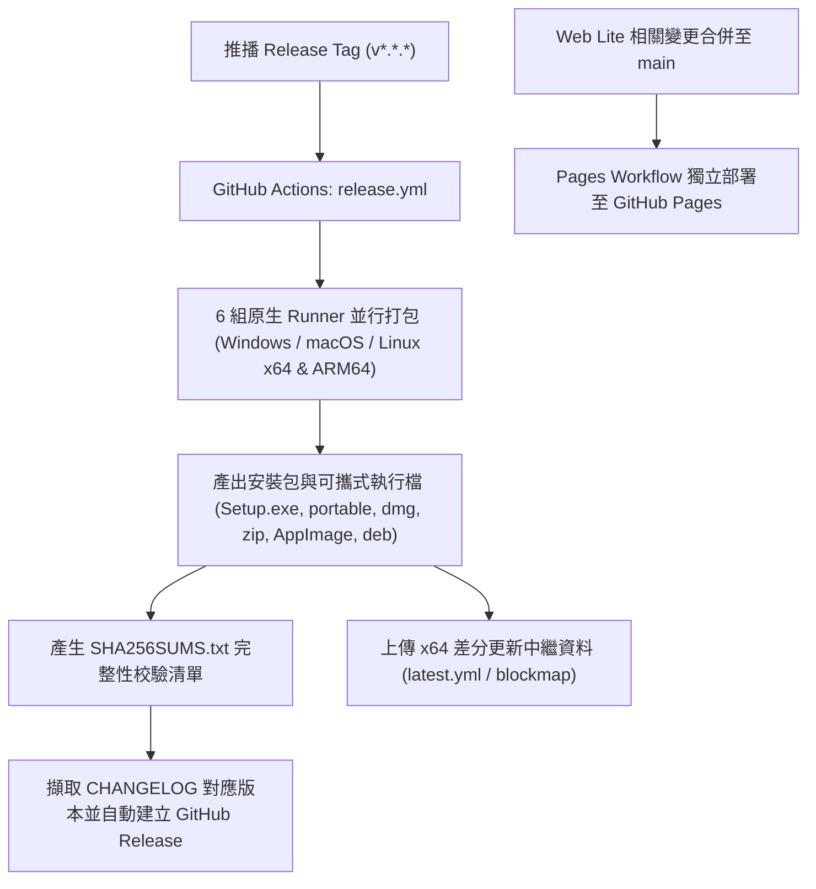

# Release 自動化與版本規則

MQTTape 使用 GitHub Actions、Conventional Commits 與 Electron-builder 實現自動化建置與跨平台發布。本文件詳細記錄版本判定原則、建置流程、支援平台架構、更新機制與簽章維護規範。

---

## 📌 版本如何判定

MQTTape 嚴格遵循[語意化版本 (Semantic Versioning, SemVer)](https://semver.org/lang/zh-TW/) 規範（`vMAJOR.MINOR.PATCH`）：

| 提交類型 | 版本變化 | 說明 | 範例 |
| --- | --- | --- | --- |
| `feat:` | minor (次版號) | 新增向後相容的功能 | `0.11.0` → `0.12.0` |
| `fix:`、`perf:` | patch (修訂號) | 向後相容的問題修正或效能優化 | `0.12.0` → `0.12.1` |
| 類型後加 `!` 或內文含 `BREAKING CHANGE:` | major (主版號) | 包含不相容的重大架構或 API 變更 | `0.12.0` → `1.0.0` |
| `docs:`、`style:`、`refactor:`、`test:`、`chore:`、`ci:` | 不版更 | 純維護、文件或重構變更，併入下次發布 | - |

### Conventional Commits 提交規範

專案所有 Git Commit 標題均使用 Conventional Commits 格式，並以繁體中文清楚說明變更意圖，例如：

```text
feat(mqtt): 支援 Protobuf 與 Sparkplug B 訊息解碼 (#43)
fix(session): 修正關閉分頁時殘留連線與插槽洩漏問題
perf(ui): 限制大型 Payload 渲染記憶體並優化分頁未讀計數
chore(release): 準備 v0.12.0 發布
```

---

## 🚀 發布流程與自動化架構



### 自動發布步驟

1. **功能開發與驗證**：完成功能分支開發，通過 `npm run typecheck`、`npm run lint`、`npm test` 及 `npm run test:e2e`。
2. **準備版本日誌**：更新 `package.json` 版本號與 `CHANGELOG.md` 繁體中文發布明細。
3. **建立 Release Tag**：在 `main` 分支建立 `vX.Y.Z` 標籤並推送至 GitHub（例如 `git tag v0.12.0 && git push origin v0.12.0`）。
4. **多架構並行建置 (GitHub Actions Matrix)**：
   - `windows-latest` (Windows x64): 產出 NSIS 安裝檔、Portable 綠色版與 `latest.yml` 更新描述。
   - `windows-11-arm` (Windows ARM64): 產出原生 ARM64 NSIS 安裝檔與 Portable 版。
   - `macos-15-intel` (macOS x64): 產出 Intel 架構 DMG 與 ZIP 封裝。
   - `macos-latest` (macOS ARM64): 產出 Apple Silicon 原生 DMG 與 ZIP 封裝。
   - `ubuntu-latest` (Linux x64): 產出 AppImage、deb 與 `latest-linux.yml` 更新描述。
   - `ubuntu-24.04-arm` (Linux ARM64): 產出原生 ARM64 AppImage 與 deb 封裝。
5. **產生 Checksums 雜湊**：自動計算所有發布資產的 SHA-256 雜湊值並輸出 `SHA256SUMS.txt`。
6. **建立 GitHub Release**：從 `CHANGELOG.md` 擷取 Tag 對應版本，將 `###` 標題轉為與 LatticeTerm 相同的 `## 🚀`／`## 🛠️` Release 版型，以第一個粗體重點產生描述型標題，再附上平台與簽章狀態後發布。
7. **Web Lite 獨立部署**：`pages.yml` 不由 Release Tag 觸發；當 Web Lite 相關路徑合併至 `main` 時，才會獨立部署至 [GitHub Pages](https://nickyclin.github.io/mqttape/)。

---

## 📦 發布產物與平台架構表

MQTTape 為三大作業系統與兩大主流 CPU 架構提供原生編譯的二進位安裝檔與可攜套件：

| 作業系統 | CPU 架構 | 檔案格式 | 檔案名稱模式 | 更新機制 |
|---|---|---|---|---|
| **Windows** | x64 (Intel/AMD) | NSIS 安裝檔 (`.exe`) | `MQTTape-Setup-<version>-x64.exe` | 🟢 支援背景自動更新 |
| **Windows** | x64 (Intel/AMD) | Portable 免安裝 (`.exe`) | `MQTTape-<version>-portable-x64.exe` | ⚪ 手動下載更新 |
| **Windows** | ARM64 | NSIS 安裝檔 (`.exe`) | `MQTTape-Setup-<version>-arm64.exe` | ⚪ 手動下載更新 |
| **Windows** | ARM64 | Portable 免安裝 (`.exe`) | `MQTTape-<version>-portable-arm64.exe` | ⚪ 手動下載更新 |
| **macOS** | Apple Silicon (M 系列) | DMG 映像檔 (`.dmg`) / ZIP | `MQTTape-<version>-mac-arm64.dmg` | ⚪ 手動下載更新 |
| **macOS** | Intel x64 | DMG 映像檔 (`.dmg`) / ZIP | `MQTTape-<version>-mac-x64.dmg` | ⚪ 手動下載更新 |
| **Linux** | x64 (AMD64) | AppImage / Debian 套件 (`.deb`) | `MQTTape-<version>-linux-x86_64.AppImage` / `MQTTape-<version>-linux-amd64.deb` | 🟢 支援背景自動更新 |
| **Linux** | ARM64 (aarch64) | AppImage / Debian 套件 (`.deb`) | `MQTTape-<version>-linux-arm64.AppImage` | ⚪ 手動下載更新 |
| **Web Lite** | 跨平台網頁 | 靜態 Web 應用 | [線上即開即用](https://nickyclin.github.io/mqttape/) | 🟢 瀏覽器即時載入最新版 |

---

## 🛡️ 程式碼簽章與更新安全政策

### 1. 程式碼簽章 (SignPath)
- 免費開源程式碼簽章由 [SignPath.io](https://about.signpath.io/) 提供，憑證由 [SignPath Foundation](https://signpath.org/) 提供。
- 專案簽章政策請參考 [PRIVACY.md](../PRIVACY.md) 與 [docs/SIGNPATH.md](SIGNPATH.md)。
- 在 SignPath 申請核准與簽章流程完成前發布之 Windows 套件暫未簽章；請使用者在下載後透過 Release 提供的 `SHA256SUMS.txt` 進行完整性比對。
- macOS 套件目前尚未加入 Apple Developer ID 簽名與公證 (Notarization)。

### 2. 自動更新策略 (`electron-updater`)
- **Windows x64 Setup** 與 **Linux x64** 套件內建 `electron-updater`，會在應用程式啟動時及每隔 6 小時主動查詢 GitHub Releases 的差分更新中繼資料（`latest.yml` / `latest-linux.yml`），下載完成後可一鍵重新啟動更新。
- **ARM64 與 Portable 版本**：為避免共用 x64 差分資料導致架構錯亂，ARM64 版本於介面標題列提供「ARM64・下載更新」引導手動下載，待獨立更新 Feed 建立後另行啟用自動換版。

### 3. SHA-256 完整性校驗
所有 GitHub Release 資產均會附帶 `SHA256SUMS.txt`。使用者可在下載後使用下列指令驗證檔案完整性：

```powershell
# Windows PowerShell
Get-FileHash MQTTape-Setup-0.12.0-x64.exe -Algorithm SHA256
```

```bash
# Linux / macOS
sha256sum -c SHA256SUMS.txt
```

---

## 📋 發布維護檢查清單 (Maintainer Checklist)

在進行新版本 Tag 發布前，請依序確認：

- [ ] 所有相關 PR 均已通過 CI 檢查並合併至 `main`。
- [ ] 執行本機完整檢查：`npm run typecheck && npm run lint && npm test && npm run test:e2e` 全數通過。
- [ ] 更新 `package.json` 中的 `"version"` 欄位。
- [ ] 在 `CHANGELOG.md` 頂部加入新版本條目，至少包含一個符合內容的主要區段：
  - `### 🚀 新增功能`
  - `### 🛠️ 問題修正與優化`（問題修正、效能、介面或安全性調整統一歸入此區）
- [ ] 確認版本條目第一個粗體重點可作為清楚的 Release 描述型標題。
- [ ] 提交並推送版更變更：`git commit -m "chore(release): 準備 vX.Y.Z 發布"`。
- [ ] 建立 Git Tag 並推送：`git tag vX.Y.Z && git push origin vX.Y.Z`。
- [ ] 監控 GitHub Actions `Release` workflow 執行狀態（確認 6 組 Runner 與 Publish 成功）。
- [ ] 檢視 GitHub Release 頁面產物與 `SHA256SUMS.txt` 是否齊全。
